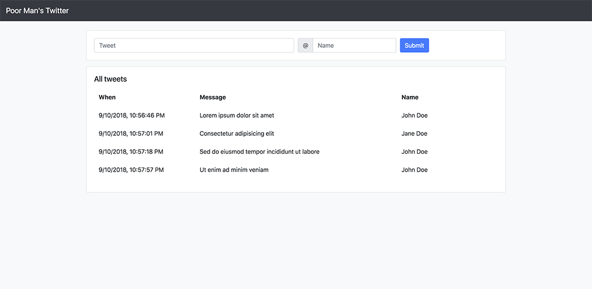

Poor Man's Twitter using VUE and Django

- `python manage.py runserver`
- `python manage.py test`

#### api/backend
- `.python-version` (3.7.0-pmt) virtualenv based on python 3.7.0 using https://github.com/pyenv/pyenv-virtualenv
- contrary to python conventions:
  - code indentation using 2 spaces
  - prefering `"` over `'`
- requested features implemented decoupled from project inside `pmtwitter` app
- the test suite only covers common cases

#### spa/frontend
- skipped client-side validation in favour of server-side to keep it simple
- error handling for `POST:/api/v1/tweets/` not 100% implemented (connection errors, to keep it simple)
  - this can be solved decently with Axios, (or JQuery, but I choose to ignore JQuery in favour of native `fetch`)
- used some ES6 syntax so a recent browser is required
  - this can be solved with a transpiler
- used hosted version of vue and bootstrap keep it simple
